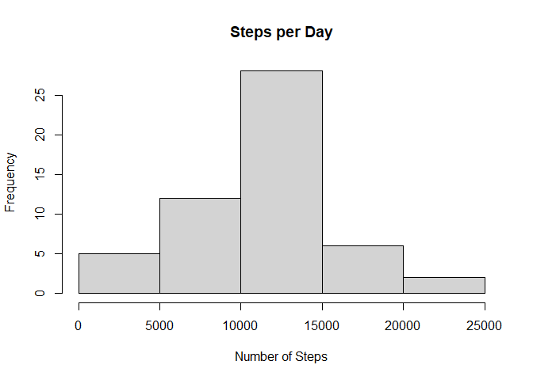
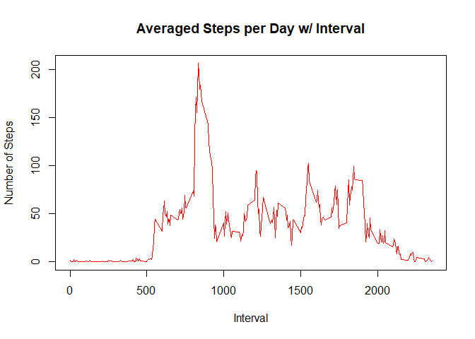
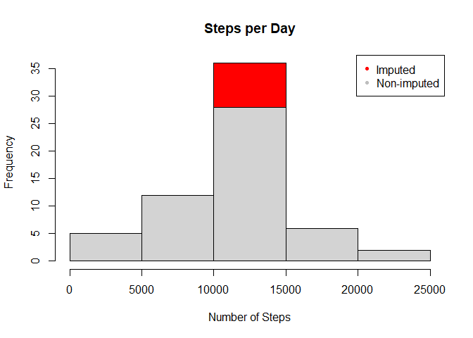
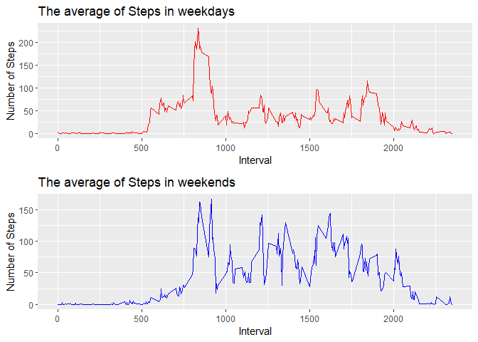

Introduction
------------

It is now possible to collect a large amount of data about personal
movement using activity monitoring devices such as a Fitbit, Nike
Fuelband, or Jawbone Up. These type of devices are part of the
“quantified self” movement – a group of enthusiasts who take
measurements about themselves regularly to improve their health, to find
patterns in their behavior, or because they are tech geeks. But these
data remain under-utilized both because the raw data are hard to obtain
and there is a lack of statistical methods and software for processing
and interpreting the data.

This assignment makes use of data from a personal activity monitoring
device. This device collects data at 5 minute intervals through out the
day. The data consists of two months of data from an anonymous
individual collected during the months of October and November, 2012 and
include the number of steps taken in 5 minute intervals each day.

The data for this assignment can be downloaded from the course web site:

Dataset: Activity monitoring data \[52K\] The variables included in this
dataset are:

steps: Number of steps taking in a 5-minute interval (missing values are
coded as NA) date: The date on which the measurement was taken in
YYYY-MM-DD format interval: Identifier for the 5-minute interval in
which measurement was taken The dataset is stored in a
comma-separated-value (CSV) file and there are a total of 17,568
observations in this dataset.

    # download data from source and unzip data
    file<-'repdata_data_activity.zip'
    download.file('http://d396qusza40orc.cloudfront.net/repdata%2Fdata%2Factivity.zip',file,method='curl')
    unzip(file)

    # Read data and take a look of data
    data <- read.csv("activity.csv")
    head(data)

    ##   steps       date interval
    ## 1    NA 2012-10-01        0
    ## 2    NA 2012-10-01        5
    ## 3    NA 2012-10-01       10
    ## 4    NA 2012-10-01       15
    ## 5    NA 2012-10-01       20
    ## 6    NA 2012-10-01       25

What is mean total number of steps taken per day?
-------------------------------------------------

1.  Calculate the total number of steps taken per day
2.  If you do not understand the difference between a histogram and a
    barplot, research the difference between them. Make a histogram of
    the total number of steps taken each day
3.  Calculate and report the mean and median of the total number of
    steps taken per day

<!-- -->

    # get the sum of the steps w/ respect to date variable
    steps_perday <- aggregate(steps ~ date, data, sum)
    head(steps_perday)

    ##         date steps
    ## 1 2012-10-02   126
    ## 2 2012-10-03 11352
    ## 3 2012-10-04 12116
    ## 4 2012-10-05 13294
    ## 5 2012-10-06 15420
    ## 6 2012-10-07 11015

    # generate a histogram for steps per day
    hist(steps_perday$steps, main = paste("Steps per Day"),xlab="Number of Steps")

    # average (or mean) of Steps per day
    rmean <- mean(steps_perday$steps,na.rm=TRUE)
    rmean

    ## [1] 10766.19

    # median of Steps per day
    rmedian <- median(steps_perday$steps,na.rm=TRUE)
    rmedian

    ## [1] 10765

What is the average daily activity pattern?
-------------------------------------------

1.  Make a time series plot (i.e. type = “l”) of the 5-minute interval
    (x-axis) and the average number of steps taken, averaged across all
    days (y-axis)
2.  Which 5-minute interval, on average across all the days in the
    dataset, contains the maximum number of steps?

<!-- -->

    # get the average of steps per date w/ respect to interval variable
    steps_interval <- aggregate(steps ~ interval, data, mean)
    head(steps_interval)

    ##   interval     steps
    ## 1        0 1.7169811
    ## 2        5 0.3396226
    ## 3       10 0.1320755
    ## 4       15 0.1509434
    ## 5       20 0.0754717
    ## 6       25 2.0943396

    # generate a plot for averaged Steps per date w/ interval
    plot(steps_interval$interval,steps_interval$steps, type="l", col='red', xlab="Interval", ylab="Number of Steps",main="Averaged Steps per Day w/ Interval")

    # get the interval which has the max averaged Steps
    max_interval <- steps_interval[which.max(steps_interval$steps),1]
    max_interval

    ## [1] 835

Imputing missing values
-----------------------

Note that there are a number of days/intervals where there are missing
values (coded as NA). The presence of missing days may introduce bias
into some calculations or summaries of the data.

1.  Calculate and report the total number of missing values in the
    dataset (i.e. the total number of rows with NAs)
2.  Devise a strategy for filling in all of the missing values in the
    dataset. The strategy does not need to be sophisticated. For
    example, you could use the mean/median for that day, or the mean for
    that 5-minute interval, etc.
3.  Create a new dataset that is equal to the original dataset but with
    the missing data filled in.
4.  Make a histogram of the total number of steps taken each day and
    Calculate and report the mean and median total number of steps taken
    per day. Do these values differ from the estimates from the first
    part of the assignment? What is the impact of imputing missing data
    on the estimates of the total daily number of steps?

<!-- -->

    # calculate tooal missing data in the dataset
    total_missing <- sum(!complete.cases(data))
    total_missing

    ## [1] 2304

    # get the average of steps w/ date 
    ave_steps <- aggregate(steps ~ interval, data, mean)
    new_addmissing <- NULL
    for (i in 1:nrow(data)) {
        tmp <- data[i, ]
        if (is.na(tmp$steps)) {
            steps <- subset(ave_steps, interval == tmp$interval)$steps
        } else {
            steps <- tmp$steps
        }
        new_addmissing <- c(new_addmissing, steps)
    }
    head(new_addmissing)

    ## [1] 1.7169811 0.3396226 0.1320755 0.1509434 0.0754717 2.0943396

    # update (or create) new dataset by adding NA step data w/ date variable
    new_data<-data
    new_data$steps <- new_addmissing
    head(new_data)

    ##       steps       date interval
    ## 1 1.7169811 2012-10-01        0
    ## 2 0.3396226 2012-10-01        5
    ## 3 0.1320755 2012-10-01       10
    ## 4 0.1509434 2012-10-01       15
    ## 5 0.0754717 2012-10-01       20
    ## 6 2.0943396 2012-10-01       25

    # generate a histogram for steps per day using new data
    new_steps_perday <- aggregate(steps ~ date, new_data, sum, na.rm = TRUE)
    hist(new_steps_perday$steps, main = paste("Steps per Day"), col='red', xlab="Number of Steps")
    # overlap w/ the histogram using original data 
    hist(steps_perday$steps, main = paste("Steps Each Day"), xlab="Number of Steps", add=T)
    legend("topright", c("Imputed", "Non-imputed"), col=c("red", "grey"),pch=c(20,20),cex=1)

    # average (or mean) of Steps per day using new data
    rmean <- mean(new_steps_perday$steps,na.rm=TRUE)
    rmean

    ## [1] 10766.19

    # median of Steps per day using new data
    rmedian <- median(new_steps_perday$steps,na.rm=TRUE)
    rmedian

    ## [1] 10766.19

    # generate difference in the average of Steps per day between original and new data
    rmediandiff <- mean(new_steps_perday$steps,na.rm=TRUE) - mean(steps_perday$steps,na.rm=TRUE)
    rmediandiff

    ## [1] 0

    # generate difference in the median of Steps per day between original and new data
    rmeandiff <- median(new_steps_perday$steps,na.rm=TRUE) - median(steps_perday$steps,na.rm=TRUE)
    rmeandiff

    ## [1] 1.188679

Are there differences in activity patterns between weekdays and weekends?
-------------------------------------------------------------------------

For this part the weekdays() function may be of some help here. Use the
dataset with the filled-in missing values for this part.

1.  Create a new factor variable in the dataset with two levels –
    “weekday” and “weekend” indicating whether a given date is a weekday
    or weekend day.
2.  Make a panel plot containing a time series plot (i.e. type = “l”) of
    the 5-minute interval (x-axis) and the average number of steps
    taken, averaged across all weekday days or weekend days (y-axis).
    See the README file in the GitHub repository to see an example of
    what this plot should look like using simulated data.

<!-- -->

    # generate the steps data by sorting date variable into weekday and weekend
    weekdays <- c("Monday", "Tuesday", "Wednesday", "Thursday", "Friday")
    new_data$week = as.factor(ifelse(is.element(weekdays(as.Date(new_data$date)),weekdays), "Weekday", "Weekend"))
    steps_week <- aggregate(steps ~ interval + week, new_data, mean)
    head(steps_week)

    ##   interval    week      steps
    ## 1        0 Weekday 2.25115304
    ## 2        5 Weekday 0.44528302
    ## 3       10 Weekday 0.17316562
    ## 4       15 Weekday 0.19790356
    ## 5       20 Weekday 0.09895178
    ## 6       25 Weekday 1.59035639

    library(ggplot2)
    library(ggpubr)

    ## Warning: package 'ggpubr' was built under R version 4.0.3

    p1<-ggplot(steps_week[which(steps_week$week=='Weekday'),] , aes(x = interval , y = steps)) + geom_line(col='red') + ggtitle("The average of Steps in weekdays") + scale_x_continuous("Interval") + scale_y_continuous("Number of Steps")
    p2<-ggplot(steps_week[which(steps_week$week=='Weekend'),] , aes(x = interval , y = steps)) + geom_line(col='blue') + ggtitle("The average of Steps in weekends") + scale_x_continuous("Interval") + scale_y_continuous("Number of Steps")
    ggarrange(p1,p2,nrow=2)

Note that the `echo = FALSE` parameter was added to the code chunk to
prevent printing of the R code that generated the plot.
